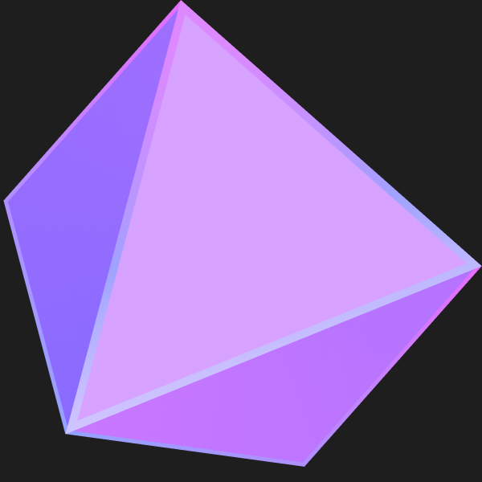

<h3 align="left">Indigo</h3>

Indigo is an **experimental** multiparadigm programming language designed to lay focus on functional programming, clearity and convinience.
Inspired by F# and Haskell, it aims to deliver satisfactory functional programming features, while exploring new concepts.
```julia
struct Person = (name: String, age: Int)

let greet (p: Person) => IO = println "Hello " : p.name
let main => IO = do
    let person = Person { name: "Lily", age: 22 }
    greet person
end
# Hello Lily
```
```julia
map (`*`2), [2, 4, 6, 8]     # [4, 8, 12, 16]
```
### Features
* Structures
* Traits
* Polymorphism
* Partial Functions
* Lambda/Anonymous functions
* Pattern Matching
* Types
* Function Composition/Pipelines
* Imports
* Generics

### Roadmap
* More advanced type system (e.g refinement types)
* Uniform Function Call Syntax (considered/researching)
* Named and optional parameters
